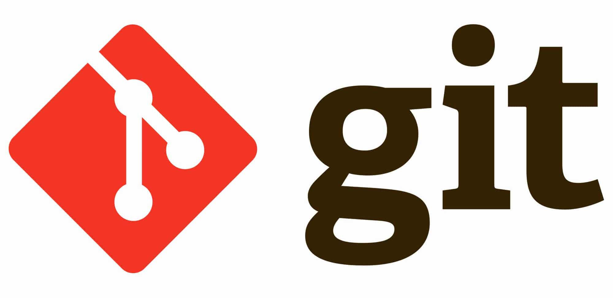

# Git Commands

Create a new repository on the command line
-------------------------
* git init  
* git add .  
* git commit -m "first commit"   
* git branch -M main  
* git remote add origin https://github.com/имяПользователя/проект.git   
* git push -u origin main  

…or push an existing repository from the command line  
it remote add origin https://github.com/имяПользователя/проект.git  
* git branch -M main  
* git push -u origin main  

Commands
-------------------------
* git init  
// Эта команда создаст .git репозиторий в Вашем проекте. Репозиторий или “repo” это коллекция всех изменений, которые были совершены на протяжении всего времени после инициализации репозитория. Это первое что нужно сделать для нового проекта.

* git add имяФайла.расширение  
// Замените “имяФайла.расширение” на любой файл, изменения которого Вы пытаетесь зафиксировать, например “index.html”. Эта команда добавит файл в “staging area”(участок подготовки). Воспринимайте staging area, как секцию в которой файлы проходят подготовку к перемещению в Ваш репозиторий.

* git add .  
// Если Вы хотите добавить всё из директории проекта в staging area, то эта команда сделает всё сама.

* git add *.html  
// Если Вы хотите добавить все файлы с расширением .html в staging area то эта команда отлично подойдет. Расширение можно менять в зависимости от предпочтений.

* git status  
// Покажет что уже было добавлено в staging area и какие файлы были изменены и ждут перемещения в staging area.

* git reset имяФайла.расширение  
// Убирает выбранный файл из staging area. Удаляет коммит и возвращает к изминениям.

* git rm --cached имяФайла.расширение  
// Убирает файл из staging area и определяет его как игнорируемый.

* git restore   
// Вовзращает удаленный файл в рабочей директории.

* git clean -fd
// Удаляет файлы из репозитория, например если добавили файлы и поняли что они нам не нужны.

* git commit -m "Описание коммита"  
// Берёт файлы из staging area и “фиксирует” их в Ваш локальный репозиторий. В кавычки следует вставить краткое описание изменений для конкретного коммита. Постарайтесь описать коммит краткими деталями, например: “устранил проблему при изменении имени пользователя” вместо подобных сообщений “какие-то изменения”

* git commit -a -m "Описание коммита"  
// Создает коммит и индексирует состотяние репозитория

* git commit --amend --no-edit
//  Изменяет последний коммит, например если забыли добавить файл и хотим добавить файл уже в текущий коммит. Изминения в текущий коммит разрешается делать только в том случае, если изменения еще не были отправлены во внешнюю систему.

* git log  
// Просмотор коммитов, перечисляет коммиты сделанные в репозитории в обратном к хронологическому порядке

* git log -p   
// Показывает разницу в каждом коммите

* git show название коммита  
// Показывает какие изменения произошли в указанном коммите. Достаточно указать первые семь символов "хэша".

* git blame <путь до файла>   
// Эта команда выводит файл и рядом с каждой строчкой показывает того, кто ее менял и в каком коммите:

* git checkout “названиеВетки или коммита”  
// Перключает в указанный коммит или ветку, смотря что указывать. Позволит Вам переключить контроль над созданной Вами веткой и работать в её пределах. Здесь Вы можете совершать любые изменения кода. Когда Вы будете готовы можно совершить commit изменений и отправить изменения в GitHub (об этом ниже) или же можно удалить ветвь, если что-то пошло не так или Вам больше не нужны изменения сделанные в этой ветке.

* git rm -- cached -r .  
// Удаляет отслеживание файлов индексации из Stage Area.

* touch .gitignore  
// Эта команда создаст файл с названием .gitignore. Вы можете открыть этот файл в текстовом редакторе и прописать названия файлов или директорий, изменения в которых Вы не хотели бы отслеживать (они будут игнорироваться Git). Изменения в игнорируемых файлах не будут отображаться при выполнении git status.

* git branch  
// Отображает все ветки в текущем репозитории

* git branch названиеВетки  
// Создает сущность, называемую branch(ветвь). Ветвь - это точная копия Ваших файлов.

* git branch -m название ветки  
// Переименует текущую ветку

* git branch -d названиеВетки  
// Удаляет ветку, в название ветки указываем какую ветку нам следует удалить.

* git checkout -b “названиеВетки”  
// Создает новую ветку и переходит в нее.

* git merge названиеВетки  
// Находясь в Master(главной) ветви, Вы можете использовать эту команду, чтобы взять коммиты из любой из ветвей и соединить их вместе. Слияние другой ветки (feature branch), в основную ветку (receiving branch).

* git revert  
// Безопасный способ отменить операцию без потери истории коммитов. Команда отменяет действия прошлых коммитов, создавая новый, содержащий все отменённые изменения. Эта команда полезна, когда вы уже запушили изменения в удаленный репозиторий, так как она сохраняет нетронутым исходный коммит.

* git reset --hard HEAD~   
// Позволяет удалить последний коммит.
Это опасная операция, которую нужно делать только в том случае, если речь идет про новые коммиты, которых нет ни у кого, кроме вас.

* git reset --hard HEAD~2    
// Позволяет удалить последние два коммита.Нужно делать только в том случае, если речь идет про новые коммиты, которых нет ни у кого, кроме вас.

* git fetch  
// Загружает коммиты, файлы и ссылки из удаленного репозитория в ваш локальный репозиторий. Извлеките данные с помощью команды fetch, если хотите увидеть, над чем работают остальные.

* git remote add origin https://github.com/имяПользователя/проект.git  
// Эта команда определит “местоположение” Вашего удалённого репозитория. Всё что было до этого происходило исключительно в локальном репозитории на Вашем компьютере. Вам нужно будет перейти в GitHub аккаунт и создать новый удалённый репозиторий, куда Вы сможете отправлять изменения из локального репозитория.

* git remote -v  
// Показывает привязку к удаленному репозиторию 

* git log --oneline --graph  
// Отображает наглядный список изменененных веток.

* git diff имя файла  
// Отображает последние изминения файла.

* git remote  
// Выведет список из всех удалённых репозиториев, которые были добавлены к Вашему проекту.

* git remote show -n имя  
// чтобы посмотреть информацию в удалённом репозитории, служит та же команда, но с указанием имени. Опция -n служит для того, чтобы не устанавливать при выполнении команды связь с самим хранилищем, а использовать только локально кэшированную информацию.

* git push -u origin master  
// Эта команда отправит локальные изменения в удалённый репозиторий. Таким образом эту команду стоит прописывать только первый раз.

* git push  
// отправляет ваш проект со всеми изминениями на GitHub

* git push --delete origin название ветки  
// Удаление ветки которую мы отправили на удаленный репозиторий

* git push -all  
// Отправить все ветки на удаленный репозиторий

* git clone https://github.com/имяПользователя/проект.git  
// Если у Вас отсутствует проект на личном или рабочем компьютере, то эта команда поможет клонировать/загрузить весь проект в текущую директорию.

* git pull  
// Если Вы работаете над одним и тем же проектом с несколькими людьми, то эта команда позволит загрузить последнюю версию из удалённого репозитория и обновить вашу локальную версию.

* rm README.txt  
// Удаление файла.

* mkdir название каталога  
// Создает новый каталог

* git help  
// Вызывает справку

* команда help  
// Краткий help по команде.

Git config 
-------------------------
 > git config --global user.name "Your Name"     
 > git config --global user.email "yourmail@mail.com"  
// Эти команды определят информацию, которая будет использоваться при каждом commit. Их стоит выполнить всего один раз при первичной установке Git.

